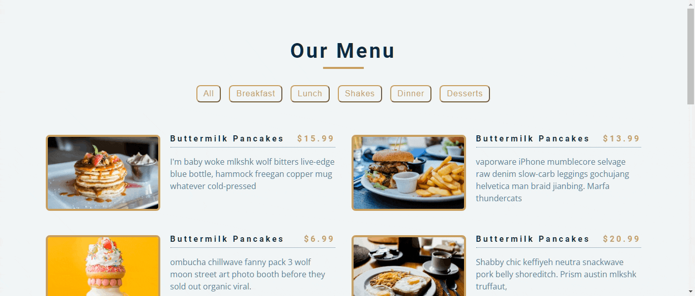

<div align="center">
<h1>Restaurant menu</h1>
  
**_Tutorial project focusing on array and objects._**
  


  
[Features](#features)  • 
[Getting started](#getting-started)  •
[How to use](#how-to-use)  •
[Credits](#credits)


</div>

## Features
- Fully responsive (desktop and mobile)
- Filtering by category

## Getting started
To begin to use this project, choose one of the following options:
- Clone the repo: `git clone https://github.com/pehmattos/restaurant-menu.git`
- Download on GitHub
- Fork the repo

Now open `index.html`. That's it!

## How to use
- Place an image in `img/`
- Create an item to add to menu. Follow this example: 

```js
// add in const menu app.js

{
id: 1,
title: "buttermilk pancakes",
category: "breakfast",
price: 15.99,
img: "./img/item-1.jpeg",
desc: `I'm baby woke mlkshk wolf bitters live-edge blue bottle, hammock freegan copper mug whatever cold-pressed`,
},
```

## Credits
- [FreeCodeCamp](https://www.freecodecamp.org/news/javascript-projects-for-beginners/)
- _John Smilga_ - [Github](https://github.com/john-smilga/javascript-basic-projects/tree/master/08-menu) | [Website](https://www.johnsmilga.com/)
- Google Fonts
- Font Awesome


